<div align="center">


<h1>Starter Kits Platform</h1>

<p><strong>The Strategic Engineering & Scaffolding Plane for Global Developer Experience and Rapid Application Delivery.</strong></p>

[]()
[]()
[]()

<br/>

> **"Speed is the only sustainable competitive advantage."** 
> **Starter Kits Platform (Starter-Ops)** is an institutional-grade platform designed to provide a secure, measurable, and highly automated foundation for global developer experience. It orchestrates the entire lifecycle—from curated blueprint definitions to dynamic template rendering and automated project scaffolding.

</div>

---

## 🏛️ Executive Summary

Modern engineering requires more than just code; it requires a standardized starting point. Organizations often fail to scale not because of a lack of talent, but because of fragmented project structures and the overhead of manually setting up boilerplate for every new microservice.

This platform provides the **Engineering Scaffolding Plane**. It implements a complete **DevEx Intelligence Framework**, enabling Platform Engineering teams to manage application blueprints as a first-class citizen. By automating the scaffolding process, we ensure that teams are building on a foundation of strategic excellence and organizational best practices from day zero.

---

## 📐 Architecture Storytelling: Principal Reference Models

### 1. Principal Architecture: Global Accelerator & Blueprint Orchestration Plane
This diagram illustrates the end-to-end flow from blueprint curation to CLI-driven project initialization and enterprise-grade deployment.

```mermaid
graph LR
    %% Subgraph Definitions
    subgraph BlueprintRegistry["Blueprint & Template Registry"]
        direction TB
        Kits["Curated Starter Kits (React/Go/Python)"]
        Templates["Base Jinja2 Templates"]
        Governance["Governance & Compliance Policies"]
    end

    subgraph GeneratorPlane["Scaffolding & Rendering Engine"]
        direction TB
        CLI["Platform CLI Tool (Typer)"]
        API["FastAPI Orchestrator"]
        Renderer["Dynamic Template Renderer"]
        State["Project State Store"]
    end

    subgraph ProjectEcosystem["Standardised Project Output"]
        direction TB
        Code["Scaffolded Source Code"]
        CICD["Standard CI/CD Pipelines"]
        Infrastructure["Terraform/Bicep Modules"]
        Obs["Observability Dashboards"]
    end

    subgraph Operations["Platform Governance & Ops"]
        direction TB
        Dash["DevEx Command Center"]
        Audit["Forensic Usage Audit"]
        Upgrade["Automated Upgrade Manager"]
    end

    subgraph Security["Zero-Trust Security Baseline"]
        direction TB
        IAM["OIDC / RBAC Identity"]
        Secret["Vault / Secret Injection"]
        Policy["Sentinel / OPA Guardrails"]
    end

    %% Flow Arrows
    Kits -->|1. Define Standards| Governance
    Governance -->|2. Authorise| API
    CLI -->|3. Request Project| API
    API -->|4. Fetch Template| Kits
    API -->|5. Render| Renderer
    Renderer -->|6. Scaffold| ProjectEcosystem
    
    ProjectEcosystem -->|7. Register Usage| State
    State -->|8. Visualize| Dash
    Dash -->|9. Audit| Audit
    Upgrade -->|10. Version Patch| ProjectEcosystem
    
    Security -->|11. Inject Baseline| ProjectEcosystem

    %% Styling
    classDef registry fill:#f5f5f5,stroke:#616161,stroke-width:2px;
    classDef generator fill:#ede7f6,stroke:#311b92,stroke-width:2px;
    classDef project fill:#e8f5e9,stroke:#1b5e20,stroke-width:2px;
    classDef ops fill:#fce4ec,stroke:#880e4f,stroke-width:2px;
    classDef security fill:#fffde7,stroke:#f57f17,stroke-width:2px;

    class BlueprintRegistry registry;
    class GeneratorPlane generator;
    class ProjectEcosystem project;
    class Operations ops;
    class Security security;
```

### 2. The Starter Kit Lifecycle: Template to Deployment
The automated steps taken to transform a blueprint into a live production service.

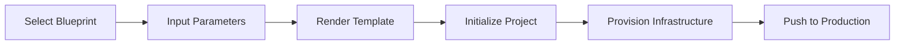

### 3. Dynamic Template Rendering Engine
The internal logic for merging user context with base blueprints.

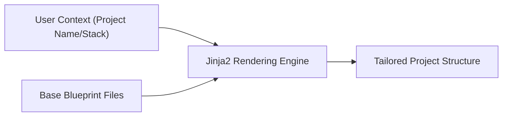

### 4. CLI Tooling Workflow: The Developer Experience
High-velocity commands for developers to manage their project lifecycle.

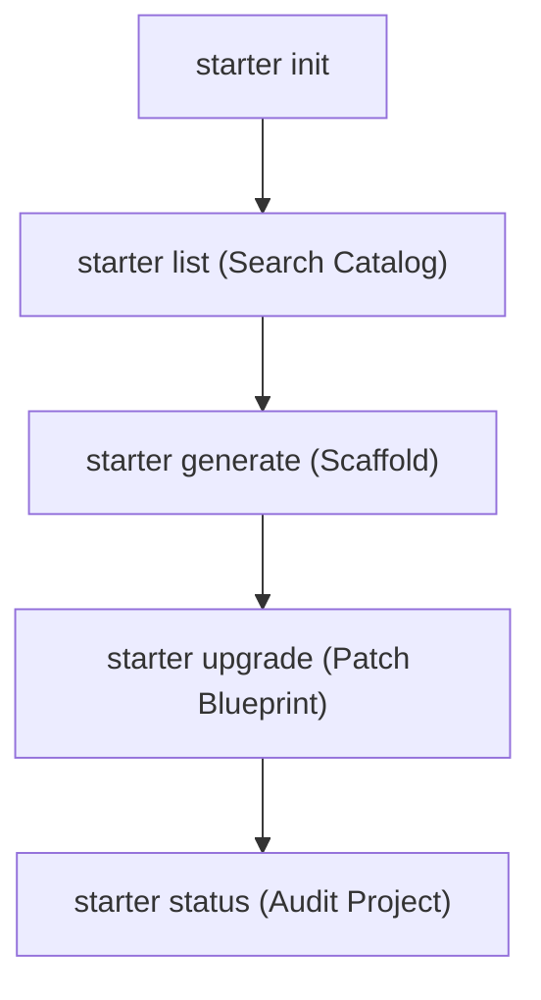

### 5. Multi-Stack Technology Matrix
Standardizing diverse technology stacks under a single governance model.

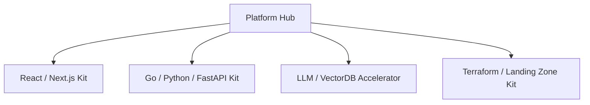

### 6. Enterprise Security Baseline Integration
Ensuring every new project is born secure with baked-in guardrails.

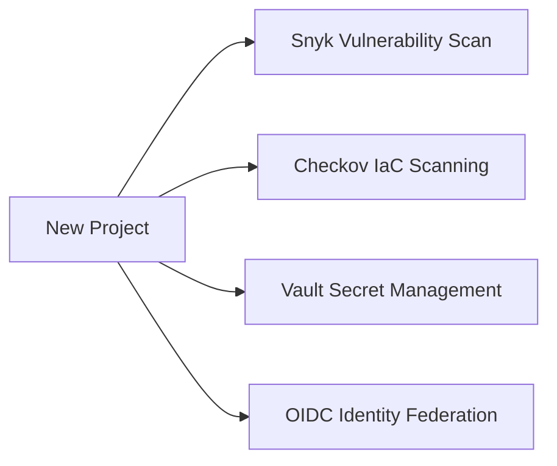

### 7. Automated Project Scaffolding Pipeline
Deconstructing the layers of a scaffolded starter kit.

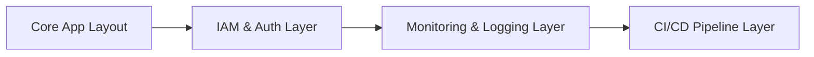

### 8. Identity & RBAC for Platform Ops
Managing who can manage blueprints and approve organizational standards.

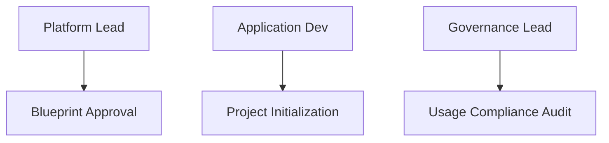

### 9. Observability & Monitoring Defaults
Default dashboards and alerts provided in every starter kit.

```mermaid
graph LR
    Kit["Starter Kit"] --> Prom["Prometheus Metrics"]
    Kit --> Loki["Loki Logs"]
    Kit --> Dash["Standard Grafana Dashboard"]
```

### 10. IaC Module Alignment: The Infrastructure Bridge
Linking starter kits to the central repository of modular Terraform.

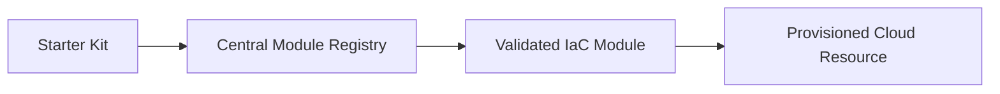

### 11. Metadata Lake for Forensic Audit
Tracking kit adoption and compliance trends across the enterprise.

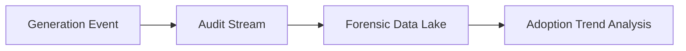

---

## 🏛️ Core Platform Pillars

1.  **Curated Kit Library**: Centralized catalog of production-ready blueprints for Web, API, AI, and Cloud Infrastructure.
2.  **Dynamic Template Rendering**: Policy-driven engine that renders complex project structures with intelligent parameter substitution.
3.  **Automated Project Scaffolding**: Orchestrated generation of complete, buildable projects with security and observability baked in.
4.  **Developer Experience CLI**: High-velocity CLI tool for developers to discover, initialize, and upgrade projects.
5.  **Architectural Governance**: Strategic management of approved blueprints, ensuring every project adheres to corporate standards.
6.  **Immutable Best Practice Enforcement**: Automated inclusion of CI/CD, Docker, and monitoring defaults in every kit.

---

## 🛠️ Technical Stack & Implementation

### Platform Engine & APIs
*   **Framework**: Python 3.11+ / FastAPI.
*   **Template Engine**: Jinja2-powered dynamic project file rendering.
*   **Generator Engine**: Orchestrated file scaffolding and structure management.
*   **CLI**: Typer-based high-velocity CLI for developer terminals.
*   **State Management**: PostgreSQL (Metadata) and Redis (Template Cache).

### Platform Dashboard (UI)
*   **Framework**: React 18 / Vite.
*   **Theme**: Violet / Slate (Modern Developer Experience aesthetic).
*   **Visualization**: Recharts for scaffolding velocity and kit popularity heatmaps.

### Infrastructure & DevOps
*   **Runtime**: AWS EKS or Azure Kubernetes Service (AKS).
*   **IaC**: Modular Terraform for deploying the platform hub and generator workers.

---

## 🏗️ IaC Mapping (Module Structure)

| Module | Purpose | Real Services |
| :--- | :--- | :--- |
| **`infrastructure/api`** | Management plane and CLI backend | EKS, PostgreSQL, Redis |
| **`infrastructure/storage`** | Template and metadata storage | S3, EFS, RDS |
| **`infrastructure/ci-cd`** | Scaffolding validation pipelines | GitHub Actions, Jenkins, CircleCI |
| **`infrastructure/auth`** | Developer identity and RBAC | Azure AD, Okta, Keycloak |

---

## 🚀 Deployment Guide

### Local Principal Environment
```bash
# Clone the starter kits platform
git clone https://github.com/devopstrio/starter-kits.git
cd starter-kits

# Configure environment
cp .env.example .env

# Launch the Platform stack
make up

# Simulate a project generation via CLI
make generate-kit

# List all available blueprints
make list-kits
```

Access the Platform Command Center at `http://localhost:3000`.

---

## 📜 License
Distributed under the MIT License. See `LICENSE` for more information.

---
<div align="center">
  <p>© 2026 Devopstrio. All rights reserved.</p>
</div>
