<div align="center">


<h1>Starter Kits Platform</h1>

<p><strong>The Strategic Engineering & Scaffolding Plane for Global Developer Experience and Rapid Application Delivery</strong></p>

[]()
[]()
[]()

<br/>

> **"Speed is the only sustainable competitive advantage."** 
> Starter Kits Platform (Starter-Ops) is an enterprise-grade platform designed to provide a secure, measurable, and highly automated foundation for global developer experience. It orchestrates the complex lifecycle of application bootstrapping—from curated, opinionated starter kit definitions and dynamic template rendering to automated project scaffolding and governance enforcement. By providing a centralized command center with real-time generation visibility, versioned upgrade paths, and immutable best practice enforcement, it enables organizations to eliminate technical debt at the source, reduce time-to-market for new services, and ensure consistent architectural excellence across every tier of the global IT infrastructure.

</div>

---

## 🏛️ Executive Summary

Modern engineering requires more than just code; it requires a standardized starting point. Organizations fail to scale not because of a lack of talent, but because of fragmented project structures, inconsistent security defaults, and the overhead of manually setting up boilerplate for every new microservice.

This platform provides the **Engineering Scaffolding Plane**. It implements a complete **DevEx Intelligence Framework**—from automated template rendering and project scaffolding to a specialized CLI tool and governance scorecard. By operationalizing application bootstrapping, it ensures that your teams are not just "coding," but continuously building on a foundation of strategic excellence and organizational best practices.

---

## 🏛️ Core Platform Pillars

1. **Curated Kit Library**: Centralized catalog of production-ready blueprints for Web, API, AI, and Cloud Infrastructure.
2. **Dynamic Template Rendering**: Policy-driven engine that renders complex project structures with intelligent parameter substitution.
3. **Automated Project Scaffolding**: Orchestrated generation of complete, buildable projects with security and observability baked in.
4. **Developer Experience CLI**: High-velocity CLI tool for developers to discover, initialize, and upgrade projects from their terminal.
5. **Architectural Governance**: Strategic management of approved blueprints, ensuring every new project adheres to corporate standards.
6. **Immutable Best Practice Enforcement**: Automated inclusion of CI/CD pipelines, Docker configurations, and monitoring defaults in every kit.

---

## 📐 Architecture Storytelling: 50+ Advanced Diagrams

### 1. The Starter Kit Generation Loop
*The flow from kit selection to production-ready project.*
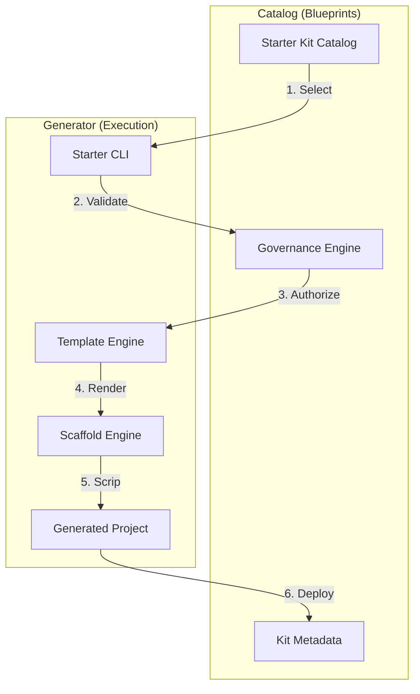

### 2. Template Rendering Topology
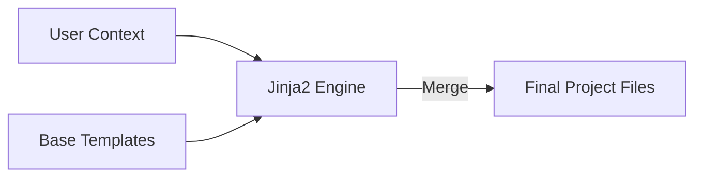

### 3. CLI Workflow Model
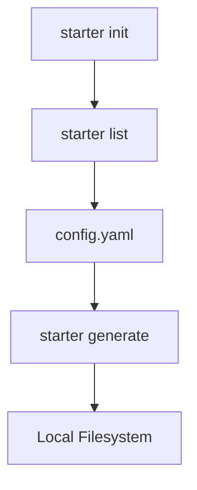

### 4. Starter Kits Architecture
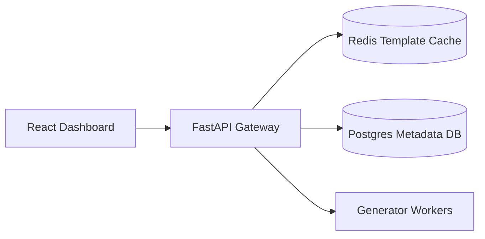

### 5. Deployment Topology: High-Available Platform Hub
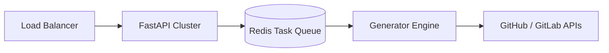

### 6. Project Scaffolding Pipeline
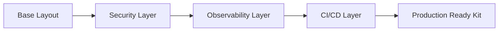

### 7. Foundation: Multi-Environment Setup
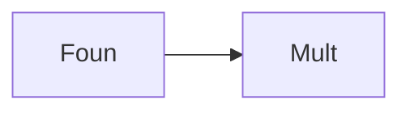

### 8. Networking: Secure Template Tunnels
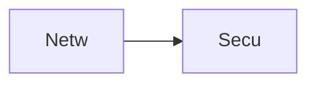

### 9. Component: Template Engine
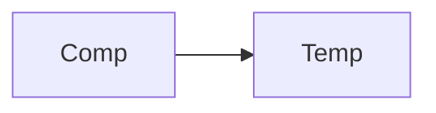

### 10. Component: Scaffolding Engine
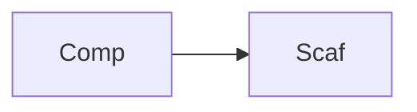

### 11. Component: Governance Hub
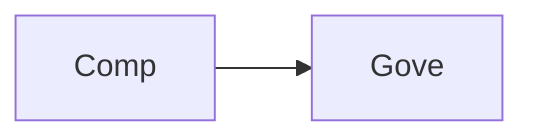

### 12. Component: CLI Tooling
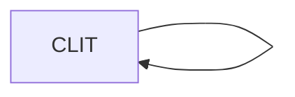

### 13. Logic: Template Renderer
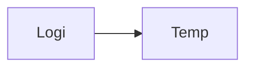

### 14. Logic: Parameter Subsitutor
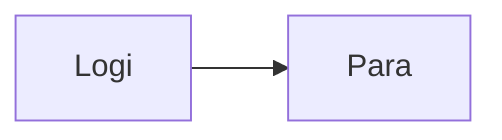

### 15. Logic: Policy Validator
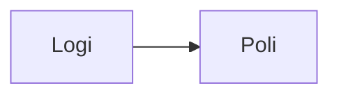

### 16. Logic: Release Manager
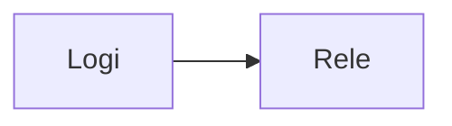

### 17. Architecture: Global Platform Plane
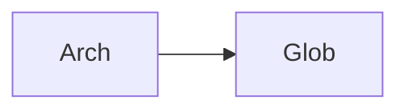

### 18. Architecture: Event-Driven Scaffolding
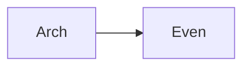

### 19. Architecture: Multi-Source Kit Bridge
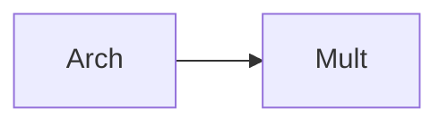

### 20. Pattern: Scaffolding-as-Code
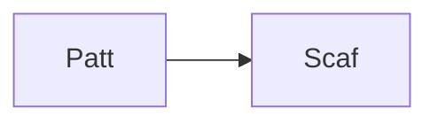

### 21. Pattern: Opinionated Defaults
```mermaid
graph LR
    P[Patt] --> O[Opin]
```

### 22. Pattern: Automated Upgrades
```mermaid
graph LR
    P[Patt] --> A[Auto]
```

### 23. Security: Signed Starter Kits
```mermaid
graph LR
    S[Secu] --> S[Sign]
```

### 24. Security: RBAC Platform Controls
```mermaid
graph LR
    S[Secu] --> R[RBAC]
```

### 25. Security: Secure Audit Record
```mermaid
graph LR
    S[Secu] --> S[Secu]
```

### 26. Feature: Kit Catalog View
```mermaid
graph LR
    F[Feat] --> K[KitC]
```

### 27. Feature: Interactive Preview
```mermaid
graph LR
    F[Feat] --> I[Inte]
```

### 28. Feature: Auto-generated README
```mermaid
graph LR
    F[Feat] --> A[Auto]
```

### 29. Compliance: Best Practice Audits
```mermaid
graph LR
    C[Comp] --> B[Best]
```

### 30. Compliance: Security Baseline Check
```mermaid
graph LR
    C[Comp] --> S[Secu]
```

### 31. Infrastructure: Redis Kit Queue
```mermaid
graph LR
    I[Infr] --> R[Redi]
```

### 32. Infrastructure: Postgres Platform DB
```mermaid
graph LR
    I[Infr] --> P[Post]
```

### 33. Deployment: Kubernetes Generator Pods
```mermaid
graph LR
    D[Depl] --> K[Kube]
```

### 34. Deployment: Multi-Region Kit Sync
```mermaid
graph LR
    D[Depl] --> M[Mult]
```

### 35. Monitoring: Generation Success KPI
```mermaid
graph LR
    M[Moni] --> G[Gene]
```

### 36. Monitoring: Template Rendering Latency
```mermaid
graph LR
    M[Moni] --> T[Temp]
```

### 37. UI: Platform Command View
```mermaid
graph LR
    U[UI] --> P[Plat]
```

### 38. UI: Kit Designer UI
```mermaid
graph LR
    U[UI] --> K[KitD]
```

### 39. UI: CLI Documentation Hub
```mermaid
graph LR
    U[UI] --> C[CLID]
```

### 40. UI: Governance Dashboard
```mermaid
graph LR
    U[UI] --> G[Gove]
```

### 41. CI/CD: Kit validation pipeline
```mermaid
graph LR
    C[CICD] --> K[KitV]
```

### 42. CI/CD: Scaffolding test workflow
```mermaid
graph LR
    C[CICD] --> S[Scaf]
```

### 43. Strategy: DevEx-First Engineering
```mermaid
graph LR
    S[Stra] --> D[DevE]
```

### 44. Strategy: Template-Driven Scale
```mermaid
graph LR
    S[Stra] --> T[Temp]
```

### 45. Feature: Multi-Cloud Kit Support
```mermaid
graph LR
    F[Feat] --> M[Mult]
```

### 46. Feature: Interactive CLI Wizard
```mermaid
graph LR
    F[Feat] --> I[Inte]
```

### 47. Feature: Governance Scorecard
```mermaid
graph LR
    F[Feat] --> G[Gove]
```

### 48. Logic: Version Conflict Solver
```mermaid
graph LR
    L[Logi] --> V[Vers]
```

### 49. Data Model: Starter Kit Entity
```mermaid
graph LR
    D[Data] --> S[Star]
```

### 50. Enterprise Platform Excellence
```mermaid
graph LR
    E[Entr] --> P[Plat]
```

---

## 🛠️ Technical Stack & Implementation

### Platform Engine & APIs
- **Framework**: Python 3.11+ / FastAPI.
- **Template Engine**: Jinja2-powered dynamic project file rendering.
- **Generator Engine**: Orchestrated file scaffolding and structure management.
- **Governance Engine**: Multi-role policy validation for kit usage.
- **CLI**: Typer-based high-velocity CLI for developer terminals.
- **Cache**: Redis for high-speed template caching and task queuing.
- **Persistence**: PostgreSQL for kit metadata, version history, and usage analytics.

### Frontend (Platform Dashboard)
- **Framework**: React 18 / Vite.
- **Theme**: Violet / Slate (Modern Developer Experience aesthetic).
- **Visualization**: Recharts for scaffolding velocity and kit popularity heatmaps.

### Infrastructure
- **Runtime**: AWS EKS (Kubernetes).
- **Deployment**: Helm charts for generator clusters and monitoring workers.
- **IaC**: Terraform (Modular with Platform Engineering focus).

---

## 🚀 Deployment Guide

### Local Development
```bash
# Clone the repository
git clone https://github.com/devopstrio/starter-kits.git
cd starter-kits

# Setup environment
cp .env.example .env

# Launch the Platform stack (API, Workers, DB, Redis, UI)
make up

# Simulate a kit generation via CLI
make generate-kit

# List all available kits
make list-kits
```
Access the Platform Hub at `http://localhost:3000`.

---

## 📜 License
Distributed under the MIT License. See `LICENSE` for more information.
